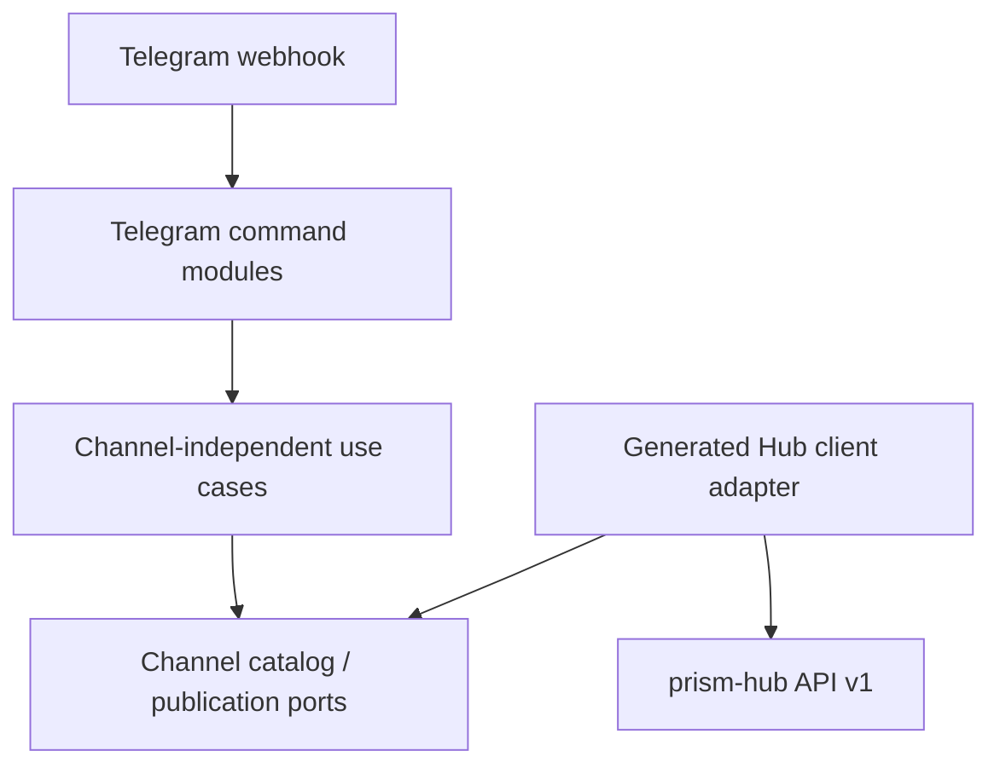

# Prism Bot

Prism Bot is the messaging-surface boundary for Prism. The first executable
module is a Telegram webhook application that consumes the versioned Prism Hub
API and never calls Prism, Meta, or another publication provider directly.

This foundation provides:

- a reusable Ruby gem and Rack application;
- a generated, pinned Prism Hub `v1` client;
- bounded traversal of Hub channel pages with validated publishing capabilities;
- deny-by-default Telegram user/chat authorization;
- verified Telegram webhook ingress and a focused Bot API sender adapter;
- extensible command routing with `/help`, `/channels`, and text-only
  `/publish` handlers;
- channel-independent publication use cases and immutable domain values;
- Full CI with tests, dependency audit, generated-client drift, architecture,
  and copyright gates.

## Boundary



The bot holds only a Hub API token and its Telegram bot token. Provider
credentials remain in Hub/runtime infrastructure. A new messaging surface adds
its own adapter and command modules; it does not add a provider branch to shared
application policy.

## Commands

- `/help` or `/start` — show the supported command syntax;
- `/channels` — list configured channels and their declared formats/content;
- `/publish text` — publish a text post to configured default channels;
- `/publish [channel-a,channel-b] text` — select explicit Hub channel IDs.

The initial Telegram handler creates a `post` variant only. Story/media input is
not simulated: `prism` does not yet provide the media/Instagram adapter required
for live Instagram stories or posts. The pinned Hub contract already models
multi-variant `post` and `story` requests so a personal client can build its UX
against a stable boundary without claiming provider readiness.

## Configuration

Set every value from `.env.example` in the process environment. Authorization
is deny-by-default: at least one allowed Telegram user or chat ID is required.
Both the Telegram webhook secret and Hub API token must contain at least 32
characters.

`PRISM_BOT_DEFAULT_CHANNEL_IDS` is a JSON array of public Hub channel IDs.
`PRISM_BOT_DISPATCH_POLICY` is either `require_all_valid` (default) or
`independent`.

Run the webhook application with:

```bash
bundle install
bundle exec puma -C config/puma.rb
```

Register `/telegram/webhook` with Telegram and set the same secret as
`PRISM_BOT_TELEGRAM_WEBHOOK_SECRET` through Telegram's `secret_token` setting.

## Verification

```bash
bundle exec rubocop
bundle exec rake test
bundle exec bundle-audit check --update
bundle exec rake check
```

The Hub contract is pinned in `contracts/prism-hub.v1.source.yaml`. Generated
code is never edited by hand; `script/generate_hub_client --check` proves drift.
The adapter follows opaque Hub cursors with a fixed page limit, rejects repeated
cursors or malformed capabilities, and retains Hub `request_id` values on typed
errors without exposing upstream private messages.

The normative ecosystem rules live in Prism's
[`engineering-principles.md`](https://github.com/aiaiaiai-org/prism/blob/master/docs/engineering-principles.md).

No public software license has been selected for this repository yet.

<!-- © 2026 aiaiaiai · aiaiaiai.org -->
