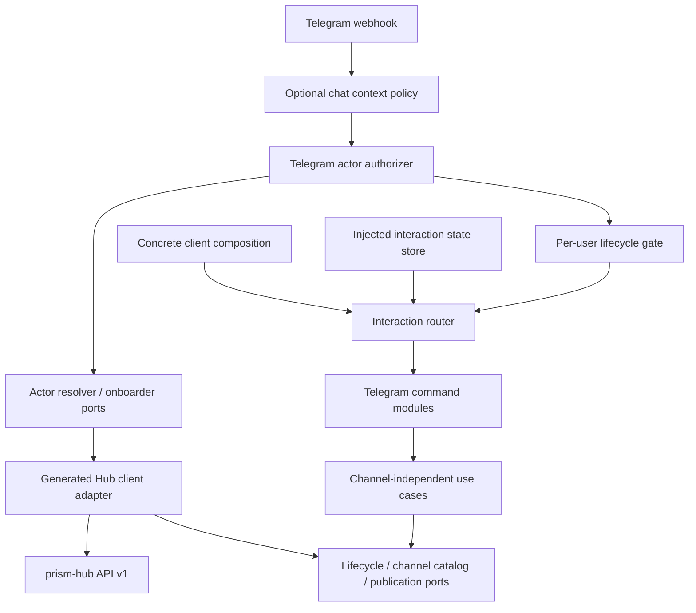

# Prism Bot

Prism Bot is the messaging-surface and bot-client infrastructure boundary for
Prism. The first executable module is a Telegram webhook application that
consumes the versioned Prism Hub API and never calls Prism, Meta, or another
publication provider directly.

This foundation provides:

- a reusable Ruby gem and Rack application;
- a public client-composition contract for concrete bot products;
- explicit, injected interaction state for deterministic multi-message flows;
- a generated, byte-pinned Prism Hub `v1` client;
- explicit `/start` onboarding plus read-only Hub-resolved human identity for ordinary Telegram commands;
- Hub-owned per-user bot lifecycle with `/status`, `/stop`, and `/resume`;
- optional local Telegram chat-context restriction that never substitutes for
  human identity authorization;
- bounded traversal of Hub channel pages with validated publishing capabilities;
- verified Telegram webhook ingress and a focused Bot API sender adapter;
- extensible interaction routing with `/help`, `/channels`, lifecycle, and
  text-only `/publish` handlers;
- channel-independent use cases and immutable domain values;
- Full CI with tests, dependency audit, generated-client drift, architecture,
  and copyright gates.

## Boundary



The bot holds only a Hub API token and its Telegram bot token. Provider
credentials remain in Hub/runtime infrastructure. Concrete products receive
safe use cases and non-secret defaults through `PrismBot::Client::Services`; they
do not receive Hub/Telegram credentials, transport objects, or `HubGateway`.

Telegram numeric user IDs are converted to opaque provider-subject strings only
at the Telegram adapter boundary. Prism Hub resolves that evidence into a
canonical `UserIdentity` and personal workspace. Usernames and chat IDs are
never treated as proof of human identity.

Bot lifecycle is also Hub-owned. One physical Telegram process can serve many
personal workspaces: `/stop` pauses only the authenticated user's logical bot
instance and never terminates the process or pauses another user.

## Concrete clients

`PrismBot::Bootstrap.build` accepts a client object:

```ruby
run PrismBot::Bootstrap.build(env: ENV, client: MyClient.new)
```

A client responds to `call(services)` and returns an immutable
`PrismBot::Client::Composition`. The built-in `PrismBot::Client::Default` uses
this exact contract for the standard command set, so external clients do not
need to reconstruct private bootstrap wiring.

A concrete product can extend the standard behaviour:

```ruby
class MyClient
  def initialize(state_store:)
    @state_store = state_store
  end

  def call(services)
    PrismBot::Client::Default.new.call(services).with(
      command_handlers: {"create_post" => BeginPost.new(sender: services.message_sender)},
      state_handlers: {"awaiting_post_content" => CapturePost.new},
      state_store: @state_store
    )
  end
end
```

A command handler can return
`PrismBot::Domain::InteractionTransition.set(InteractionState.new(...))`. The
next ordinary message from that canonical actor is routed to the matching state
handler. Commands retain priority while a state is pending, so safe lifecycle
controls remain usable. State is scoped by client instance, messaging surface,
and Hub-resolved canonical actor, never by Telegram username.

Prism Bot does not provide hidden process-global conversation persistence. The
default null store is sufficient for stateless clients and fails closed if a
stateful transition is attempted. A production multi-message client must inject
a store implementing `PrismBot::Ports::InteractionStateStore`.

## Commands

- `/start` — idempotently onboard or resolve the caller's canonical Prism identity;
- `/help` — show supported commands;
- `/status` — show `active`, `paused`, or `disabled` lifecycle state;
- `/stop` — persistently pause ordinary bot behaviour for the caller;
- `/resume` — resume a paused caller-owned bot instance;
- `/channels` — list configured channels and their declared formats/content;
- `/publish text` — publish a text post to configured default channels;
- `/publish [channel-a,channel-b] text` — select explicit Hub channel IDs.

When a personal instance is paused or disabled, ordinary command dispatch is
blocked centrally. Safe control commands (`/start`, `/help`, `/status`, `/stop`,
`/resume`) remain available. A `disabled` instance is a stronger administrative
or security state and normal `/resume` cannot clear it.

The current Telegram publication handler creates a `post` variant only. Story and
media input are not simulated: live provider composition is a separate Prism/Hub
increment.

## Configuration

Set every value from `.env.example` in the process environment. The Hub service
principal used by this bot must have `actors:onboard`, `actors:resolve`,
`bot_instances:read`, and `bot_instances:manage`, plus the channel/publication
capabilities required by enabled commands.

Human authorization is Hub-owned. `PRISM_BOT_TELEGRAM_ALLOWED_CHAT_IDS` is an
optional JSON array that restricts where the bot may be used; an empty array
allows any chat context to proceed to Hub authorization. It never authorizes a
Telegram user. The removed `PRISM_BOT_TELEGRAM_ALLOWED_USER_IDS` setting is
rejected at boot.

Both the Telegram webhook secret and Hub API token must contain at least 32
characters. `PRISM_BOT_DEFAULT_CHANNEL_IDS` is a JSON array of public Hub channel
IDs. `PRISM_BOT_DISPATCH_POLICY` is either `require_all_valid` (default) or
`independent`.

Run the default webhook application with:

```bash
bundle install
bundle exec puma -C config/puma.rb
```

Register `/telegram/webhook` with Telegram and set the same secret as
`PRISM_BOT_TELEGRAM_WEBHOOK_SECRET` through Telegram's `secret_token` setting.

## Verification

```bash
bundle exec rubocop
bundle exec rake test
bundle exec bundle-audit check --update
bundle exec rake check
```

The Hub contract is pinned in `contracts/prism-hub.v1.source.yaml`; the current
client contract is Hub `0.1.0-alpha.8`. Generated code is never edited as an
independent source of truth: `script/generate_hub_client --check` proves it
matches the pinned contract and generator. Lifecycle responses are reduced to a
single public state; internal Hub principal, workspace, and bot-instance IDs stay
server-side.

The normative ecosystem rules live in Prism's
[`engineering-principles.md`](https://github.com/aiaiaiai-org/prism/blob/master/docs/engineering-principles.md).

No public software license has been selected for this repository yet.

<!-- © 2026 aiaiaiai · aiaiaiai.org -->
