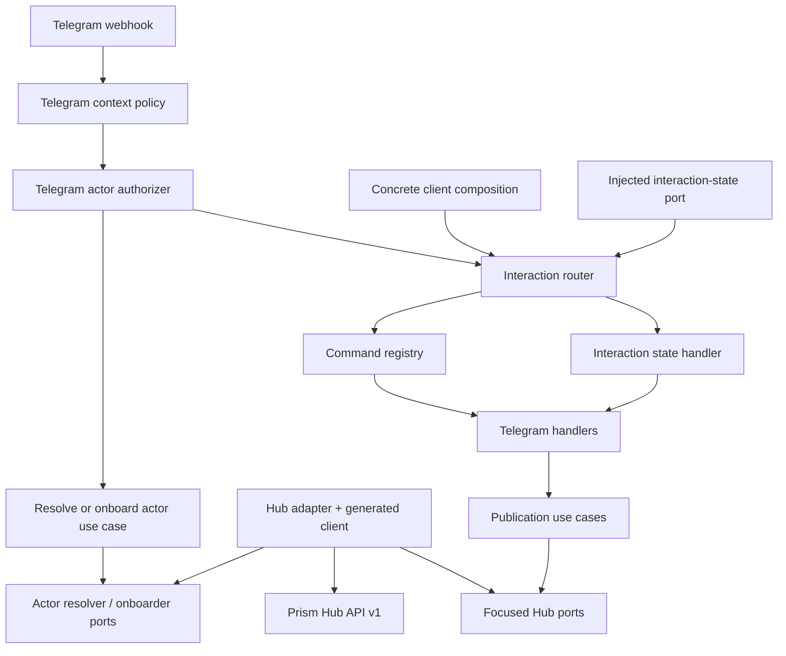

# Architecture

Prism Bot is a modular monolith and reusable bot-client infrastructure. Every
messaging surface is an inbound channel module with its own parsing and
presentation. Channel-independent publication and actor-resolution behaviour
lives in use cases and reaches Prism Hub only through focused ports. Concrete
client products compose these capabilities through the public `PrismBot::Client`
boundary instead of rebuilding infrastructure wiring.



## Responsibilities

| Layer | Owns | Must not own |
|---|---|---|
| `domain` | Immutable publication, actor, interaction-key, state, and transition values | HTTP, Telegram credentials, storage |
| `use_cases` | Channel-independent orchestration | JSON, environment, framework code |
| `ports` | Small capabilities required by use cases and interaction state | Concrete transport or persistence details |
| `channels/telegram` | Telegram parsing, context filtering, provider-subject adaptation, interaction routing, messages | Canonical identity policy, Meta credentials, provider policy |
| `client` | Safe composition services, standard client definition, immutable handler/state composition | Hub adapters, raw credentials, environment parsing |
| `adapters` | Hub HTTP, Telegram Bot API calls, Hub response validation, explicit port implementations | Publication decisions or Telegram identity semantics |
| `bootstrap` | Environment parsing, infrastructure construction, client composition | Runtime product behaviour |

## Client composition contract

`PrismBot::Bootstrap.build` accepts a client object that responds to `call` and
receives a frozen `PrismBot::Client::Services` value. Services expose only the
capabilities a client may legitimately compose: message delivery, channel
listing, publication, bot lifecycle, and non-secret publication defaults. They
do not expose Telegram tokens, Hub credentials, `HubGateway`, HTTP transport, or
provider credentials.

A client returns an immutable `PrismBot::Client::Composition` containing command
handlers, state handlers, a fallback handler, presenter, and an explicit
interaction-state store. `PrismBot::Client::Default` expresses the existing
`/start`, `/help`, `/status`, `/stop`, `/resume`, `/channels`, and `/publish`
behaviour using the same public contract. There is no parallel bootstrap path for
the built-in client.

Concrete products can extend that composition without copying infrastructure:

```ruby
base = PrismBot::Client::Default.new.call(services)
base.with(
  command_handlers: {"create_post" => begin_post},
  state_handlers: {"awaiting_post_content" => capture_post},
  state_store: durable_store
)
```

The example objects are product-owned handlers. The store is a port implementation
chosen by the concrete client/deployment. Prism Bot deliberately does not hide a
process-global conversation hash behind the API.

## Interaction state

Stateful conversations use `InteractionKey(instance_id, surface, actor_ref)`.
For Telegram, `actor_ref` comes from the Hub-resolved canonical `HumanActor`, not
Telegram username or chat label. The instance ID prevents two concrete bot
products used by the same person from sharing accidental state.

`InteractionState` is immutable and carries a validated state name plus
JSON-compatible data. Handlers request state changes by returning an immutable
`InteractionTransition` (`set`, `clear`, or `keep`). Ordinary handler return
values preserve state, which keeps existing stateless handlers compatible.

Commands have priority over pending ordinary-message state. This means lifecycle
and control commands remain deterministic while a client is waiting for a
follow-up message. An ordinary message is routed to the handler registered for
the current state. A persisted state without a registered handler is a typed,
observable configuration failure rather than an implicit fallback.

The default composition uses a fail-closed null state store. Stateless behaviour
works without persistence; the first attempted `set` transition fails visibly
unless the concrete client supplied an actual store. Production stateful clients
therefore have to make persistence ownership explicit.

## Command registry

The command router remains a registry. Adding a command means supplying another
handler object, not extending a central command or provider conditional. Telegram
command parsing is shared by the router and actor gate so `/start` cannot be
recognized differently at the identity and dispatch boundaries. The interaction
router sits around the command registry only to add explicit follow-up state
routing; it does not reinterpret commands.

## Human and machine identity

Telegram's webhook secret authenticates ingress. It does not authenticate the
human sender. The bot independently authenticates to Hub with its scoped machine
credential, while Telegram actor evidence follows this chain:

```text
Telegram numeric user ID
    -> decimal string at the Telegram adapter boundary
    -> provider=telegram, provider_scope=global
    -> ActorResolver / ActorOnboarder port
    -> Hub ProviderIdentityBinding
    -> Hub UserIdentity
    -> server-derived personal workspace + owner membership
    -> HumanActor(person:<canonical-id>, role)
```

Ordinary actor authorization uses Hub's read-only personal actor resolution. The
client does not supply a workspace identifier and cannot create or reactivate
identity state. Hub derives the personal workspace from the canonical identity
and requires its active owner membership before returning the actor projection.

`/start` is the only Telegram command that selects the separate onboarding use
case. Hub owns idempotent resolve-or-create behaviour, so repeated `/start` calls
return the same canonical identity rather than creating local bot state. A failed
ordinary resolution never falls back to onboarding. This keeps identity creation
explicit and prevents arbitrary commands from becoming account-creation events.

The resulting `AuthorizedUpdate` composes the original immutable Telegram update
with the resolved `HumanActor`. Existing command handlers consume the update
interface while interaction state scopes itself from the canonical actor.

`PRISM_BOT_TELEGRAM_ALLOWED_CHAT_IDS` is only a local context filter. An empty
list means every chat may attempt Hub actor resolution or explicit `/start`
onboarding. A configured list can reject a chat before a network call, but a chat
ID never proves who the human is. The former local Telegram user allow-list is
rejected at configuration time.

Hub's explicit `hub.actor.not_authorized` result is mapped to an ordinary
deny-without-disclosure outcome. Other Hub failures, including missing machine
capabilities, remain typed failures instead of being misreported as an unknown
human. The bot does not notify a sender when actor resolution or onboarding
itself failed, because that sender has not yet been authenticated as a human
actor.

## Delivery and failure semantics

Each `/publish` update produces a stable idempotency key:
`telegram:<instance-id>:<update-id>`. A handled or unexpected downstream failure
after actor authorization is acknowledged to Telegram after at most one user
notification attempt. This prevents the bot from deliberately replaying an
external publication after an ambiguous failure; Hub/runtime remains responsible
for enforcing idempotency at the publication boundary.

The bot never receives provider credentials and targets only public Hub channel
IDs. The generated client is derived from a byte-for-byte pinned OpenAPI file.
The Hub adapter owns cursor traversal and validates every page before channel
metadata crosses the port. It also validates actor responses and exposes only
canonical human identity plus workspace role; provider subject IDs do not enter
command presentation.

<!-- © 2026 aiaiaiai · aiaiaiai.org -->
