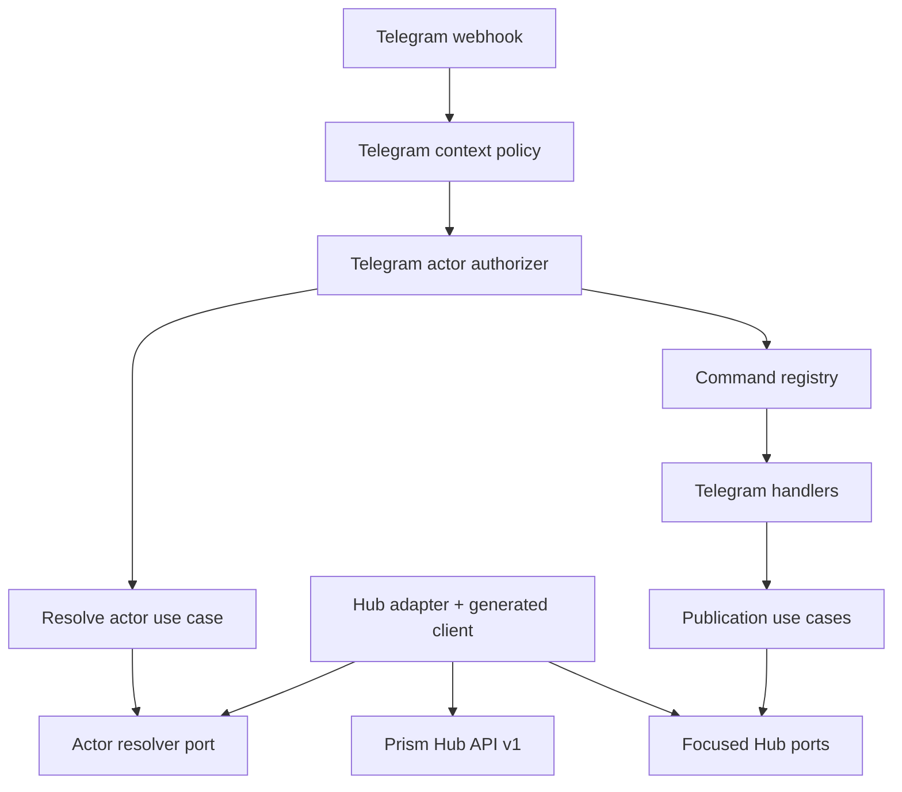

# Architecture

Prism Bot is a modular monolith. Every messaging surface is an inbound channel
module with its own parsing and presentation. Channel-independent publication
and actor-resolution behavior lives in use cases and reaches Prism Hub only
through focused ports.



## Responsibilities

| Layer | Owns | Must not own |
|---|---|---|
| `domain` | Immutable publication values and resolved canonical human actors | HTTP, Telegram, provider credentials |
| `use_cases` | Channel-independent orchestration | JSON, environment, framework code |
| `ports` | Small capabilities required by use cases | Concrete transport details |
| `channels/telegram` | Telegram parsing, context filtering, provider-subject adaptation, commands, messages | Canonical identity policy, Meta credentials, provider policy |
| `adapters` | Hub HTTP and Telegram Bot API calls, Hub response validation | Publication decisions or Telegram identity semantics |
| `bootstrap` | Environment parsing and explicit composition | Runtime business behavior |

The command router is a registry. Adding a command means supplying another
handler object, not extending a central command or provider conditional.

## Human and machine identity

Telegram's webhook secret authenticates ingress. It does not authenticate the
human sender. The bot independently authenticates to Hub with its scoped machine
credential, while Telegram actor evidence follows this chain:

```text
Telegram numeric user ID
    -> decimal string at the Telegram adapter boundary
    -> provider=telegram, provider_scope=global
    -> ActorResolver port
    -> Hub ProviderIdentityBinding
    -> Hub UserIdentity
    -> Hub WorkspaceMembership
    -> HumanActor(person:<canonical-id>, role)
```

The resulting `AuthorizedUpdate` composes the original immutable Telegram update
with the resolved `HumanActor`. Existing command handlers consume the update
interface while future authorization can use the actor without reconstructing
identity from Telegram data.

`PRISM_BOT_TELEGRAM_ALLOWED_CHAT_IDS` is only a local context filter. An empty
list means every chat may attempt Hub actor resolution. A configured list can
reject a chat before a network call, but a chat ID never proves who the human is.
The former local Telegram user allow-list is rejected at configuration time.

Hub's explicit `hub.actor.not_authorized` result is mapped to an ordinary
deny-without-disclosure outcome. Other Hub failures, including a missing
`actors:resolve` machine capability, remain typed failures instead of being
misreported as an unknown human. The bot does not notify a sender when actor
resolution itself failed, because that sender has not yet been authenticated as
a human actor.

## Delivery and failure semantics

Each `/publish` update produces a stable idempotency key:
`telegram:<instance-id>:<update-id>`. A handled or unexpected downstream failure
after actor authorization is acknowledged to Telegram after at most one user
notification attempt. This prevents the bot from deliberately replaying an
external publication after an ambiguous failure; Hub/runtime remains responsible
for enforcing idempotency at the publication boundary.

The bot never receives provider credentials and targets only public Hub channel
IDs. The generated client is derived from a byte-for-byte pinned OpenAPI file.
The Hub adapter owns cursor traversal and validates every page before channel
metadata crosses the port. It also validates actor responses and exposes only
canonical human identity plus workspace role; provider subject IDs do not enter
command presentation.

<!-- © 2026 aiaiaiai · aiaiaiai.org -->
