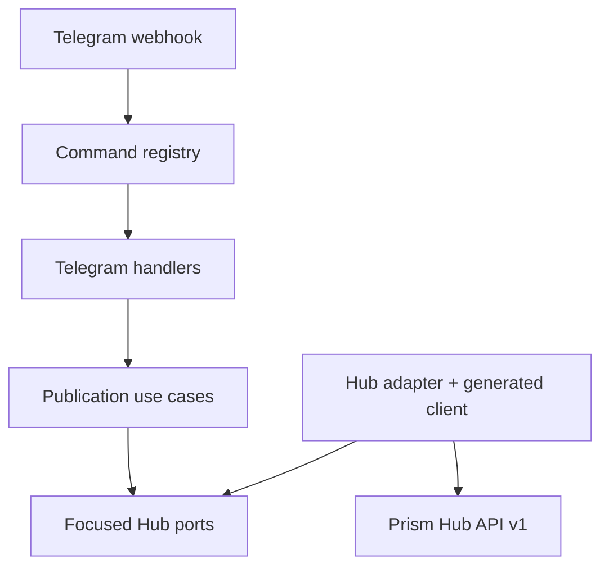

# Architecture

Prism Bot is a modular monolith. Every messaging surface is an inbound channel
module with its own parsing and presentation. Channel-independent publication
behavior lives in use cases and reaches Prism Hub only through focused ports.

## Responsibilities

| Layer | Owns | Must not own |
|---|---|---|
| `domain` | Immutable publication values and invariants | HTTP, Telegram, provider logic |
| `use_cases` | Channel-independent orchestration | JSON, environment, framework code |
| `ports` | Small capabilities required by use cases | Concrete transport details |
| `channels/telegram` | Telegram update parsing, authorization, commands, messages | Meta credentials or provider policy |
| `adapters` | Hub HTTP and Telegram Bot API calls | Publication decisions |
| `bootstrap` | Environment parsing and explicit composition | Runtime business behavior |

The command router is a registry. Adding a command means supplying another
handler object, not extending a central command or provider conditional.

## Delivery and failure semantics

Telegram's webhook secret authenticates ingress. A separate allow-list
authorizes the user or chat, with an empty policy rejected at boot.

Each `/publish` update produces a stable idempotency key:
`telegram:<instance-id>:<update-id>`. A handled or unexpected downstream failure
is acknowledged to Telegram after at most one user notification attempt. This
prevents the bot from deliberately replaying an external publication after an
ambiguous failure; Hub/runtime remains responsible for enforcing idempotency at
the publication boundary.

The bot never receives provider credentials and targets only public Hub channel
IDs. The generated client is derived from a byte-for-byte pinned OpenAPI file.
The Hub adapter owns cursor traversal and validates every page before channel
metadata crosses the port; Telegram presentation only consumes that public,
provider-neutral capability view.

<!-- © 2026 aiaiaiai · aiaiaiai.org -->
